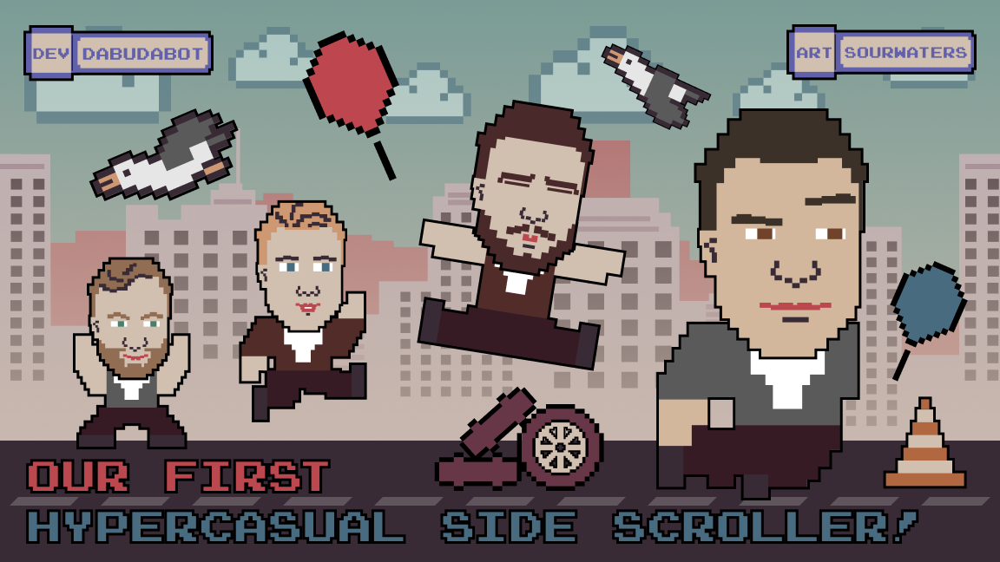
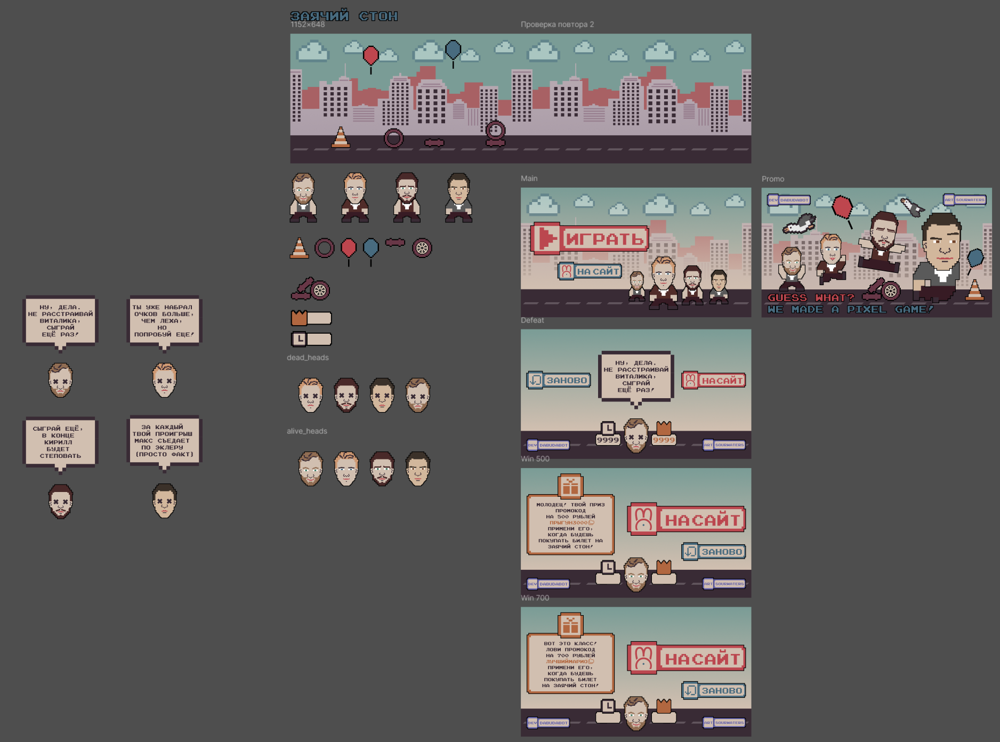
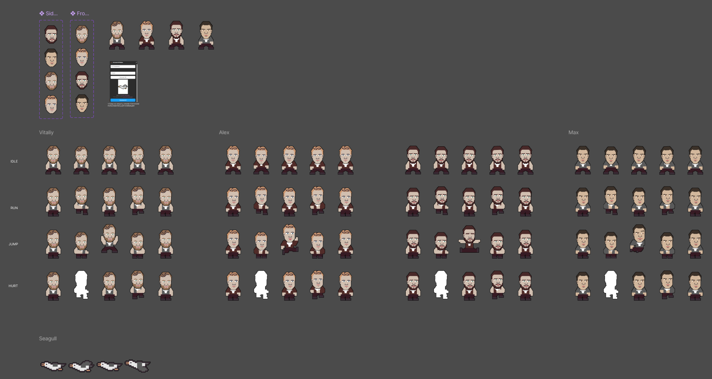

# Zayachiy Scroller



## Overview

[Zayachiy Scroller](https://dabudabot.itch.io/zayachiy-scroller) is a 2D side-scrolling game built with the [Godot Engine](https://godotengine.org/) using **GDScript**. Developed for the theater [Zayachiy Ston](https://www.zayachiyston.ru/), it serves as an analog to the [Google Chrome Dino game](https://chromedino.com/), where the player character jumps over obstacles such as **traffic cones**, **wheels**, and **balloons** while tracking scores.


### Features

+ **Side-scrolling gameplay** – The player moves through a dynamically scrolling environment with a parallax effect for enhanced depth.

+ **Obstacles & Challenges** – Includes elements like traffic and balloons that influence gameplay. The intensity and type of obstacles change over time, progressively increasing in difficulty, eventually making the game impossible to continue.

+ **Score Tracking** – Keeps track of the player's current and high scores. Depending on the result, the player receives a coupon for the theater. This feature is designed for players sitting in the theater.

+ **HUD System** – Displays important information such as score and status.

+ **Game Over Screen** – A dedicated game-over scene to handle when the player loses.

+ **Debugging Utility** – On-screen debugging messages using [print_to_screen.gd](https://github.com/Cykyrios/GodotPrintToScreen).

### Game Structure

The game consists of multiple scenes that define different aspects of gameplay:

+ **main.tscn** – The primary game scene where gameplay takes place.

+ **start.tscn** – The main menu or starting screen.

+ **gameover.tscn** – The game-over screen displayed when the player loses.

+ **hud.tscn** – The heads-up display for showing scores and other information.

+ **char.tscn** – Defines the player character.

+ **balloon.tscn**, **traffic.tscn**, and **wheel.tscn** – Obstacles that the player must avoid while moving through the game.

+ **bg.tscn** – The background parallax environment.

## Installation & Running the Game

1. Install [Godot Engine](https://godotengine.org/) (version  4.x)
2. Clone or download the repository: ```git clone https://github.com/Dabudabot/zayachiy_scroller.git```
4. Open the project in Godot.
5. Run the main.tscn scene to start the game.

or just visit https://www.zayachiyston.ru/game or https://dabudabot.itch.io/zayachiy-scroller

## Credits

Developed by [Dabudabot](https://www.linkedin.com/in/daulet-t/).

Uses [Godot Engine](https://godotengine.org/).

All art was created by @sourwaters. Check out her work on [ArtStation](https://www.artstation.com/sourwaters).



